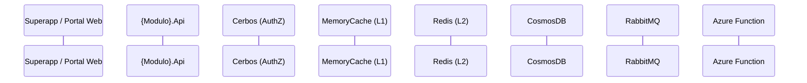
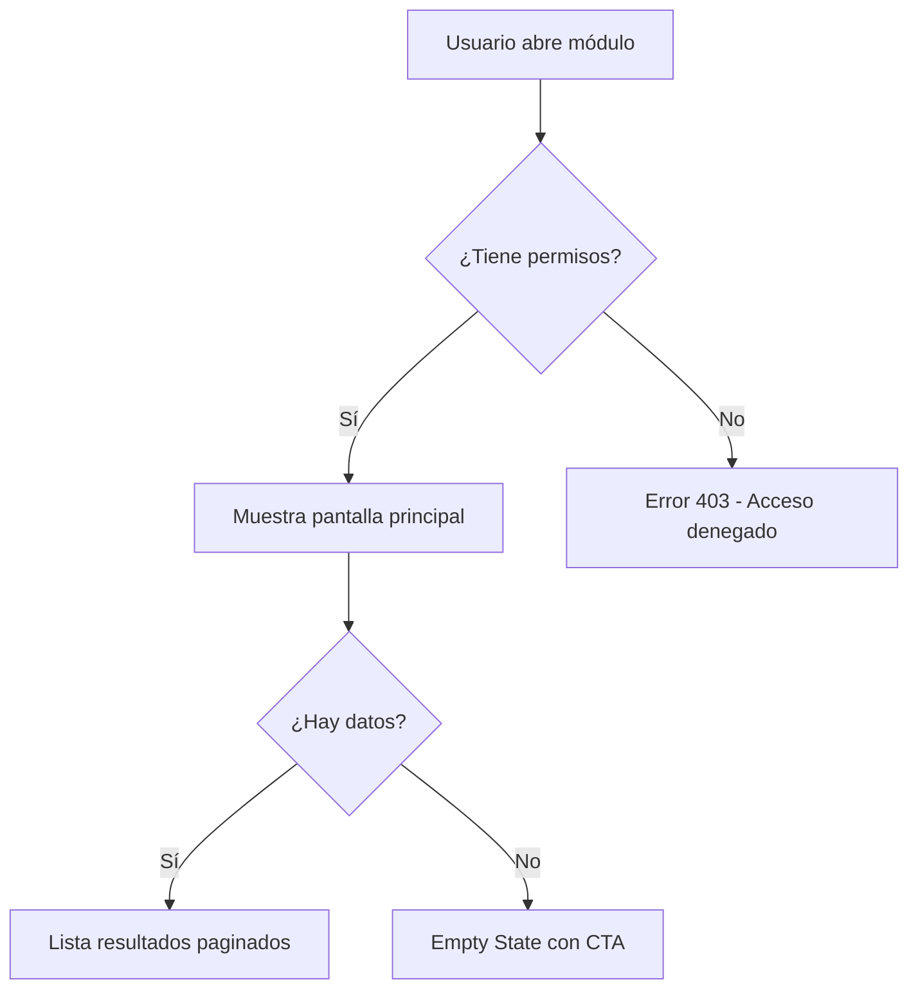

# wbt-doc-design — Fase 2: Diseño Técnico y UX

Este skill genera los entregables documentales de la Fase 2 del ciclo de vida de documentación de Workbeat.
Consulta `references/c4-guide.md` para el modelo C4 aplicado a Workbeat y `references/mermaid-patterns.md` para patrones de diagramas.

## Qué produce este skill

| Entregable | Archivo de salida | Template |
|---|---|---|
| Mockups y wireframes (doc) | `ux/mockups.md` | `assets/template-mockups.md` |
| Flujos UX y Journey Maps | `ux/flujos-ux.md` | `assets/template-flujos-ux.md` |
| Mejores prácticas aplicadas | Sección en `arquitectura.md` | — |
| Arquitectura técnica (C4) | `arquitectura.md` | `assets/template-arquitectura.md` |
| Diagrama de flujo del proceso | `diagramas/flujo-proceso.md` | `assets/template-flujo-proceso.md` |
| Diagrama(s) de secuencia | `diagramas/secuencia-{caso}.md` | `assets/template-secuencia.md` |

## Dónde guardar los archivos

```
F:\WBT\Documentacion_Base\features\{nombre-feature}\
├── arquitectura.md
├── ux/
│   ├── mockups.md
│   └── flujos-ux.md
└── diagramas/
    ├── flujo-proceso.md
    └── secuencia-{nombre-caso-de-uso}.md
```

## Proceso de ejecución

### Paso 1 — Verificar prerequisitos

Verificar que existan en la carpeta del feature:
- `07-contexto-y-alcance.md` — para entender el alcance técnico
- `casos-de-uso/` — para generar los diagramas de secuencia por CU

Si no existen, solicitar al usuario que describa el feature y el flujo principal.

### Paso 2 — Arquitectura C4 para Workbeat

Generar la arquitectura usando el modelo C4 con los niveles relevantes:

**Nivel 2 — Contenedores** (siempre incluir):
```mermaid
graph TB
    subgraph "Workbeat Platform"
        APP[Superapp Móvil<br/>React Native]
        WEB[Portal Web<br/>Angular/React]
        API[{Módulo}.Api<br/>ASP.NET Core .NET 8]
        FUNC[Azure Functions<br/>Isolated Worker]
        DB[(Azure CosmosDB<br/>NoSQL)]
        CACHE[(Redis Cache<br/>L2)]
        MQ[RabbitMQ<br/>Message Bus]
    end
    BLOB[Azure Blob Storage]
    AI[OpenAI / Leonardo AI]
```

**Nivel 3 — Componentes** (para el microservicio específico):
Descomponer en: Domain, ApplicationService, Infrastructure, API Controllers, Azure Functions.

**Componentes estándar de Workbeat que siempre aplican:**
- `Catalogo` — clase base de toda entidad del dominio
- Partition key: `{Año}-{TenantId}` en CosmosDB
- Caché L1 (MemoryCache) → L2 (Redis) → CosmosDB
- JWT (IdentityServer4) + Cerbos para auth/authz
- RabbitMQ con DLQ (5 reintentos)

### Paso 3 — Diagramas de secuencia

Generar un diagrama de secuencia por cada caso de uso principal. Incluir siempre:

**Participantes estándar de Workbeat:**


**Flujo estándar de un POST en Workbeat:**
1. App → API: Request con Bearer JWT
2. API → Cerbos: Validar permisos (tenant + claims)
3. API → CacheL1: ¿Hit en caché?
4. API → DB: Write con partition key `{año}-{tenant}`
5. API → RMQ: Publish evento
6. RMQ → Func: Trigger procesamiento asíncrono
7. API → App: Response 201/200

### Paso 4 — Flujos UX con Mermaid

Para los flujos de usuario, usar `graph TD` con nodos de decisión:



**Estados de UI que siempre documentar:**
- **Empty State** — cuando no hay datos (con call-to-action)
- **Loading State** — mientras carga
- **Error State** — cuando falla (con mensaje de negocio, no técnico)
- **Success State** — confirmación de acción completada

### Paso 5 — Mejores prácticas de la industria

Para cada decisión técnica o de UX, referenciar el estándar aplicado. Usar `references/best-practices-catalog.md` como catálogo.

### Paso 6 — Criterio de salida de Fase 2

Al finalizar, verificar:
- [ ] Mockups aprobados por stakeholders (UX sign-off)
- [ ] Arquitectura C4 revisada por arquitecto (Architecture Review)
- [ ] Diagrama de secuencia para cada CU principal
- [ ] Diagrama de flujo del proceso completo con swimlanes
- [ ] Mejores prácticas justificadas y referenciadas

Recomendar al usuario continuar con **wbt-doc-reverse-engineer** (si ya hay código) o iniciar construcción.

## Reglas de calidad

- Todos los diagramas usan Mermaid (no imágenes estáticas) para ser versionables
- Los diagramas de secuencia incluyen manejo de errores (flujos alternativos)
- La arquitectura C4 menciona explícitamente la partition key de CosmosDB
- Los flujos UX documentan los 4 estados de UI: empty, loading, error, success
- Las mejores prácticas siempre incluyen: práctica, estándar/fuente, aplicación concreta en Workbeat
