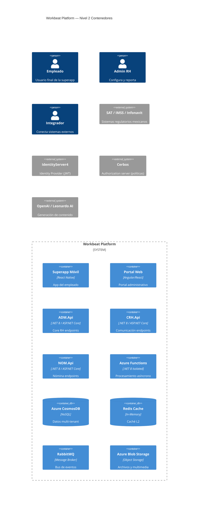
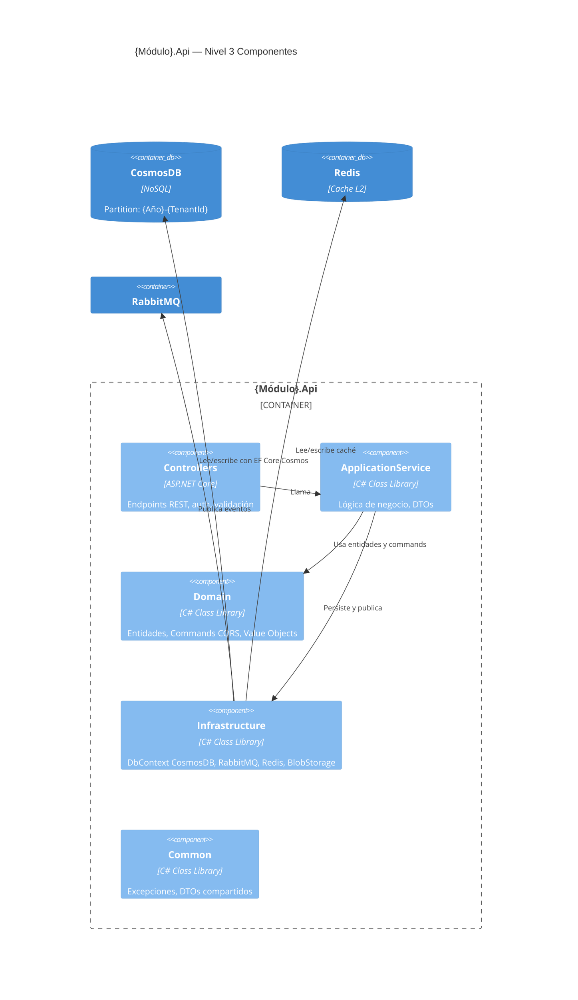
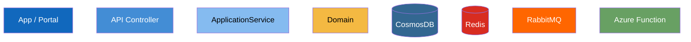
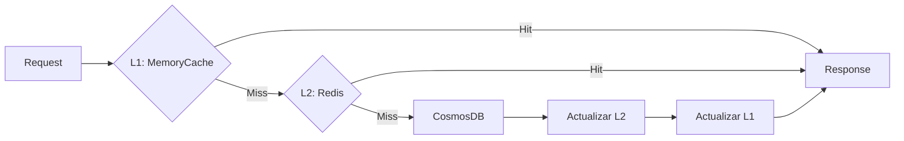

# Guía C4 Model — Aplicado a Workbeat

## Niveles del C4 Model en Workbeat

### Nivel 1: Contexto del Sistema (toda la plataforma)
Muestra Workbeat como caja negra en su entorno: usuarios, sistemas externos.

### Nivel 2: Contenedores (microservicios)
Descompone la plataforma en sus microservicios y sus tecnologías.



### Nivel 3: Componentes (internos de un microservicio)

Patrón estándar de cada microservicio Workbeat:



## Convenciones de diagrama para Workbeat

### Colores recomendados en Mermaid



### Partition Key — siempre documentar

En todo diagrama que involucre CosmosDB, incluir nota:
```
note: Partition Key = "{Año}-{TenantId}"
      Sin partition key → cross-partition scan (⚠️ costoso)
```

### Caché bicapa — patrón estándar


